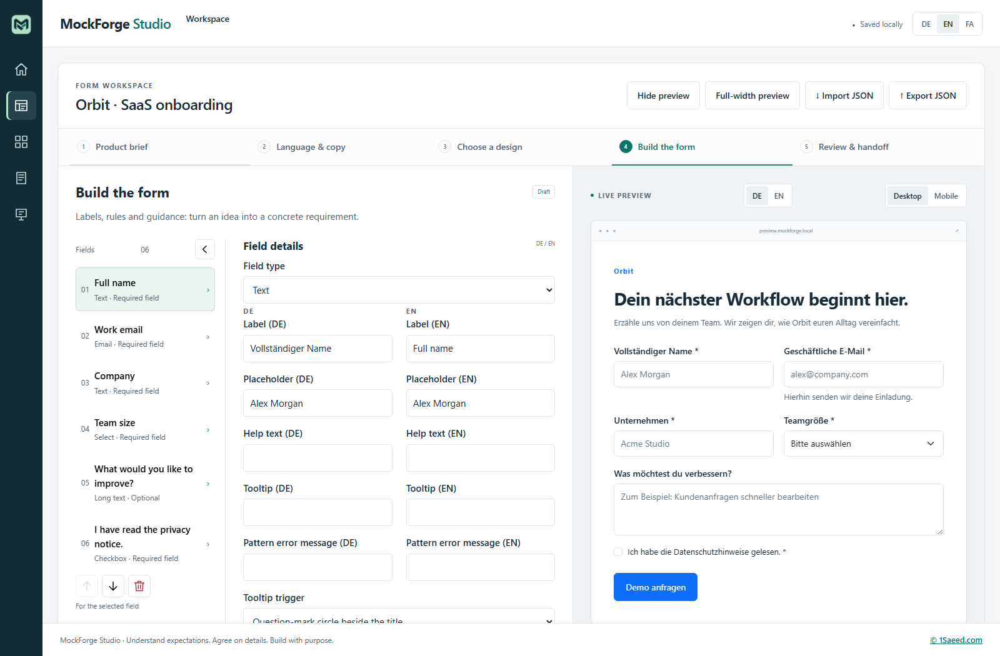

# MockForge Studio


An **open-source form prototyping studio**, licensed under MIT.

**Built with documented Clean Code practices and backed by 87 passing automated tests: 66 unit/component tests and 21 end-to-end tests.** Verified on October 1, 2026, with **98.24% line coverage**. Formatting, ESLint, translation validation and the production build also pass. See the [quality report](docs/QUALITY.md) for reproducible checks and their scope.

**Your requirements shape the product before the first implementation sprint.**

MockForge Studio helps product owners and developers agree on a form before production development starts. Review the exact experience, resolve the small details and export the specification the developer should implement.

**My commitment as a developer:** "Your wishes guide my implementation, including the small details. Before coding the production form, I want us to agree on what your users should see and what each action should do. I document those decisions so you can see exactly what I plan to deliver."



## Why agree before implementation?

"Build a demo request form" sounds clear until sales asks for a different team-size range, the owner expects personal email addresses to be blocked, or the button promises an instant trial rather than a conversation. Clarifying that after coding begins may mean changing validation, translations, layout, integrations and tests.

MockForge Studio puts those decisions in front of the owner while the form is still a mockup. Early clarification can reduce avoidable rework during actual implementation. A documented baseline also makes later scope and budget discussions clearer. The alignment session takes time, and actual savings depend on the project.

## What the owner receives before production development

| Deliverable              | Purpose                                                                 |
| ------------------------ | ----------------------------------------------------------------------- |
| Interactive form         | Check the experience, wording, required inputs and mobile layout        |
| Documented decisions     | Preserve exact rules, expected behavior and implementation boundaries   |
| JSON plus readable brief | Give the team a concrete specification to implement and test            |
| Implementation agreement | Confirm scope, acceptance criteria and unresolved technical assumptions |

The [agreement template](docs/IMPLEMENTATION_AGREEMENT_TEMPLATE.md) extends the exported brief for APIs, failure behavior and the team's actual approval channel. Changes to the form reset its local review so a previous acknowledgement does not cover an altered specification.

## Commercial conversations

| Example                     | Decision to agree with the owner                                                                                    |
| --------------------------- | ------------------------------------------------------------------------------------------------------------------- |
| SaaS demo request           | Which data qualifies a lead, and what response do we promise?                                                       |
| Commerce return             | Which reasons are allowed, and is this a return request or a refund promise?                                        |
| Agency inquiry              | Which budget/start-date choices help prepare the first conversation?                                                |
| Atlas project & procurement | Which stakeholders and line items can repeat, what are their limits, and which approval rules belong in production? |

These are fictional examples for customer discussions. See [positioning and arguments](docs/POSITIONING.md), the [15-minute demo](docs/SALES_DEMO.md) and the [twelve-slide presentation](src/assets/presentation.html).

**Bring one form idea. Agree on the details together before committing implementation effort.**

## Run locally

Requires Node.js 22 or newer. All dependencies come from the public npm registry.

```sh
git clone https://github.com/www1saeed/MockForge.git
cd MockForge
npm ci
npm start
```

Open `http://localhost:4300`. The production build is static:

```sh
npm run build
```

Deploy the contents of `dist/studio/browser/`. The relative base URL supports GitHub Pages project paths. This directory is a self-contained new project: copy **only its contents** into the new GitHub repository.

The directory can be moved beside the original mockforge workspace. Start a new session in the moved project root for the complete implementation handoff and relocation instructions. No dependency on the original directory is required.

## What works

- An overview introduces the approach before opening the full-width, five-step workspace. A narrow icon rail, persistent header and footer keep navigation available.
- German, English and Persian form copy, with one or two languages active at a time so field and button editors stay readable. Inactive translations remain stored.
- Nine native field types plus repeatable groups with card/table layouts, editable child fields and minimum/maximum entry counts. Required rules, text length constraints, localized tooltips and full-value RegEx patterns have localized messages.
- Show or hide the interactive preview on every step; it starts hidden for the brief, copy and form editor. Choose its language and desktop/mobile width separately.
- Configurable buttons: localized labels, primary/secondary/ghost/danger appearance, behavior, CSS classes, developer notes and order. Validation, submission, saving, cancellation, deletion and next/back actions are local simulations; reset clears preview inputs.
- Real Bootstrap form styling plus Material, Carbon and Fluent inspired visual presets.
- German, English and Persian UI with instant switching. Persian uses RTL layout and the bundled IranSans webfont; the Studio UI and form preview can use different directions.
- Commercial demos: SaaS lead qualification, commerce returns, agency inquiries and the large Atlas project/procurement request with every field type, team cards and a line-item table.
- LocalStorage persistence, JSON import/export and a Markdown implementation brief.
- Review checklist with reviewer name and timestamp. Specification edits invalidate the review.
- Native modal replacement confirmation with export-before-replace and cancel options.
- An [English presentation](src/assets/presentation.html) with a concrete sprint/rework example, spoken explanations, browser voice selection, transcripts, standalone HTML saving and an A4 landscape PDF layout. See the [presentation guide](docs/PRESENTATION.md).

Material, Carbon and Fluent presets are **visual approximations**, not integrations of their official component libraries. Choose the real production library with the product owner and engineering team. Brand names identify the design references and imply no endorsement.

## A practical conversation

1. Open the SaaS example and agree on the business goal and scope.
2. Discuss whether a personal email is allowed and which team-size options sales needs.
3. Inspect each selected language, validation and the mobile preview.
4. Document the expected response after submission and the future CRM integration.
5. Resolve the open questions, complete the review and export the JSON together with the brief.

The review record is local and unauthenticated. It supports an actual conversation and explicit agreement outside the app. Imports reset review status. Preview inputs are not persisted or submitted. Backend integration, email delivery, refunds and CRM workflows are outside this mockup tool.

JSON exports use Studio schema **1.3.0**. Existing Studio 1.0.0, 1.1.0 and 1.2.0 drafts are upgraded on restore/import; missing Persian values start empty and 1.0.0 also receives a submit button from its old label. Upgraded acknowledgements are cleared. Files from the original MockForge edition remain incompatible. One or two of the three supported form languages can be active, while inactive copy remains stored. Invalid RegEx edits remain in the editor until corrected; the last valid rule stays in the saved specification.

Repeat groups support one level of up to 20 child fields and 0–20 entries, with at least one child definition. The total specification limit of 100 counts groups and children together. Preview entries validate independently and use distinct radio groups. Removing an entry asks for confirmation; resetting responses returns groups to their minimum count. Response values are never persisted or exported. The Atlas example contains 26 field definitions: 12 regular fields, two groups and 12 child fields. Its team limit is 1–8 and its procurement limit is 1–12. Pricing, totals and finance approval remain production requirements to agree separately.

## Verify

```sh
npm run format:check
npm run lint
npm test
npm run test:coverage
npm run extract-i18n
npm run build
npx playwright install chromium
npm run e2e
```

Unit/component tests exercise import validation, immutable persistence, review invalidation and editor behavior. Playwright covers export/import, restore, native validation, cancellation and axe checks for both locales, all workflow steps and the design presets. Automated scans supplement manual keyboard and usability review.

## Documentation

- [Code quality and verified test results](docs/QUALITY.md)

- [Product requirements](REQUIREMENTS.md)
- [Architecture](docs/ARCHITECTURE.md)
- [Contributing and code conventions](docs/CONTRIBUTING.md)
- [Product owner workshop](docs/PRODUCT_OWNER_WORKSHOP.md)
- [Positioning and commercial examples](docs/POSITIONING.md)
- [Customer demo and portfolio copy](docs/SALES_DEMO.md)
- [Implementation agreement template](docs/IMPLEMENTATION_AGREEMENT_TEMPLATE.md)
- [GitHub publication guide](docs/PUBLISHING.md)
- [Logo and GitHub brand assets](docs/BRANDING.md)

## License

The newly authored source in this project is licensed under [MIT](LICENSE). Third-party dependencies and bundled fonts retain their own licenses. Confirm that your IranSans license permits public redistribution before publishing the font files; otherwise replace or omit them. The release workflow preserves Angular's generated dependency license notices.

## Group editing and table spacing

Empty optional group tables show no column header until an entry is added. Row delete buttons in cards and tables expose Bootstrap tooltips with the entry index and still require confirmation.

**Full-width preview** opens the form across the Studio workspace while retaining the header, icon navigation and footer. **Back to editor** restores the current editing step. Switching width preserves entered preview responses; hiding the preview discards them as before. Language and desktop/mobile preview controls remain available.

Form tooltips use Bootstrap. Each field can place its tooltip on the title or on a question-mark or information circle beside it. The circles use compact vector symbols, a subtle tinted background and clear hover/focus states. Repeated table children expose it once in the column header; card children expose it only in the first card. The group title has its own single trigger. All modes support keyboard focus and Escape dismissal.

Open **Edit child fields** to work with a child list beside its properties. The main field list becomes a narrow type-icon rail with Bootstrap tooltips showing each field's index, name and type. Closing child editing or selecting a main field restores the full list. The main list can also be collapsed or expanded manually; these view choices do not alter the specification.

Table groups offer **Table fields without gaps** for a continuous grid. This boolean setting is saved and exported, participates in review invalidation and appears in the Markdown handoff. Migrated schema 1.2.0 files without the optional `group.gapless` property retain comfortable spacing.
